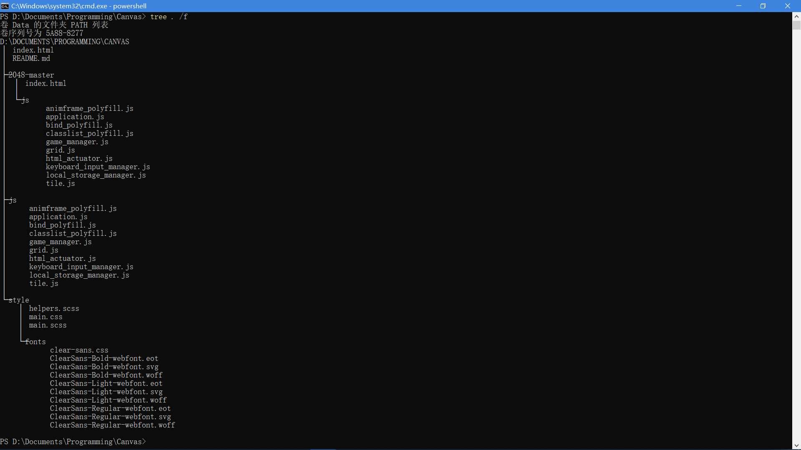

# 2048 In JavaScript

## 概述
本游戏名为2048，在一个正方形棋盘上会随机生成带有数字的方块，数字相同的两个方块可以合并为一个数值更大的方块。玩家通过上下左右方向键来控制整个盘面上方块的移动与合并方向，最终目标为出现一个数值大于等于2048的方块。若所有方格被填满且无法继续移动方块的时候则游戏结束。

---

## 实现

游戏基于Github开源代码[2048](https://github.com/gabrielecirulli/2048)修改而成，主要是在[ECMAScript2015](https://www.ecma-international.org/ecma-262/6.0/)规范下改写了整个代码

### 文件结构



---

### 定义
- 方格(Grid)：指在网页背景上显示的，由HTML tag所定义的预留空间
- 方块(Tile)：指叠放在方格上的真正可操纵对象

---

### `index.html`
构造 4 x 4 `<div>`方格作为背景并统一`class='grid-cell'`,预留一个`class='tile-container'`的`<div>`标签用来在背景方格上描绘方块。

---

### `/js/application.js` : 初始化渲染
```
window.requestAnimationFrame(function () {
    new GameManager(4, KeyboardInputManager, HTMLActuator, LocalStorageManager);
});
```
- 通过调用GameManager构造函数，来定义一个实例对象，并且输入四个参数
- 在`index.html`中最后加载此文件，目的是使浏览器加载全部JS文件之后再开始渲染避免一些奇怪的bug

---

### `/js/game_manager.js` : 游戏主事件驱动
定义GameManager类
1. 构造函数
	```
    constructor(size, InputManager, Actuator, StorageManager) {
        this.size = size;
        this.inputManager = new InputManager;
        this.storageManager = new StorageManager;
        this.actuator = new Actuator;
        this.startTiles = 2;
        this.inputManager.on("move", this.move.bind(this));
        this.inputManager.on("restart", this.restart.bind(this));
        this.inputManager.on("keepPlaying", this.keepPlaying.bind(this));
        this.setup();
    }
    ```
	- `size`控制背景方格边长（即 `size x size` ）
	- `InputManager`为`KeyboardInputManager`类的实例，按栈模型处理输入事件
	- `Actuator`为`HTMLActuator`类的实例，用来处理与HTML DOM交互有关的事件
	- `StorageManager`为`LocalStorageManager`类的实例，用来处理本地数据的读取和保存
	- `startTiles`设置初始方块数量，默认为2
	- `inputManager.on()`绑定事件与对应的方法，在`KeyboardInputManager`中按栈模型处理
	- 通过`setup()`方法初始化游戏

2. 对象方法
	1. `setup()` ： 初始化游戏
        ```
        setup() {
            var previousState = this.storageManager.getGameState();
            if (previousState) {
                this.grid = new Grid(previousState.grid.size, previousState.grid.cells);
                this.score = previousState.score;
                this.over = previousState.over;
                this.won = previousState.won;
                this.keepPlaying = previousState.keepPlaying;
            }
            else {
                this.grid = new Grid(this.size);
                this.score = 0;
                this.over = false;
                this.won = false;
                this.keepPlaying = false;
                this.addStartTiles();
            }
            this.actuate();
        }
        ```
        - 如果存在上次游戏未结束退出则通过`this.storageManager.getGameState()`自动读取上次的存档
        - 若是新游戏则创建`size x size`的方格并初始化各类参数，更新第一次`actuate()`

    2. `restart()` ： 重启游戏并清除当前状态的储存
        ```
        restart() {
            this.storageManager.clearGameState();
            this.actuator.continueGame();
            this.setup();
        }
        ```
        - 调用`this.storageManager.clearGameState()`清除当前游戏状态的储存
        - 调用`this.actuator.continueGame()`清除当前可能在HTML中显示的输/赢弹窗
        - 调用`this.setup()`新建游戏

    3. `keepPlaying()` ： 允许玩家在得分超过2048后继续游戏
        ```
        keepPlaying() {
            this.keepPlaying = true;
            this.actuator.continueGame();
        }
        ```
        - 将`this.keepPlaying`的值修改为`Ture`
        - 调用`this.actuator.continueGame()`清除当前在HTML中显示的游戏胜利弹窗

    4. `isGameTerminated()` : 当用户失败或赢得游戏或不继续玩则返回`True`
        ```
        isGameTerminated() {
            return this.over || (this.won && !this.keepPlaying);
        }
        ```
        - `this.over`指示是否失败
        - `this.won`指示是否胜利
        - `this.keepPlaying`指示用户是否继续玩

    5. `addStartTiles()` : 创造最初始方块
        ```
        addStartTiles() {
            for (var i = 0; i < this.startTiles; i++) {
                this.addRandomTile();
            }
        }
        ```
        - `this.startTiles`在构造函数中定义，指示最初方块的个数
        - `this.addRandomTile()`为初始的每个方块分配随机的数值

    6. `addRandomTile()` : 为初始方块分配随机数值
        ```
        addRandomTile() {
            if (this.grid.cellsAvailable()) {
                var value = Math.random() < 0.9 ? 2 : 4;
                var tile = new Tile(this.grid.randomAvailableCell(), value);
                this.grid.insertTile(tile);
            }
        }
        ```
        - `this.gird.cellsAvailable()`指示当前方块是否可访问
        - `Math.random() < 0.9 ? 2 : 4`按照 9 : 1 的比例随机分配初始值为 2 和 4
        - `new Tile(this.grid.randomAvailableCell(), value)`在随机一个并未被使用的区域新建一个值为`value`的方块
        - `this.gird.insertTile(tile)`把该方块放入其所在背景方格

    7. `actuate()` : 主驱动程序
        ```
        actuate() {
            if (this.storageManager.getBestScore() < this.score) {
                this.storageManager.setBestScore(this.score);
            }
            if (this.over) {
                this.storageManager.clearGameState();
            }
            else {
                this.storageManager.setGameState(this.serialize());
            }
            this.actuator.actuate(this.grid, {
                score: this.score,
                over: this.over,
                won: this.won,
                bestScore: this.storageManager.getBestScore(),
                terminated: this.isGameTerminated()
                }
            );
        }
        ```
        - `this.storageManager.getBestScore()`为历史最高得分，将其与`this.score`当前得分比较来更新历史记录
        - 通过判断`this.over`决定游戏是否继续，若继续则通过`this.storageManager.setGameState()`储存当前局面状态
        - `this.serialize()`返回序列化的当前每个方格的状态
        - 最后调用`this.actuator.actuate()`将当前状态通过HTML DOM绘制

    8. `serialize()` : 将当前每个方格的状态作为对象返回
        ```
        serialize() {
            return {
                grid: this.grid.serialize(),
                score: this.score,
                over: this.over,
                won: this.won,
                keepPlaying: this.keepPlaying
            };
        }
        ```

    9.  `prepareTiles()` : 储存所有方块的位置并重置合并信息
        ```
        prepareTiles() {
            this.grid.eachCell(function (x, y, tile) {
                if (tile) {
                    tile.mergedFrom = null;
                    tile.savePosition();
                }
            });
        }
        ```
        - 调用`this.grid.eachCell()`对每个方格执行函数，该函数检查当前方格上是否存在方块，若存在则储存其位置并将其合并源位置清空

    10. `moveTile(tile, cell)` : 将一个方块移动到另一个方格上
        ```
        moveTile(tile, cell) {
            this.grid.cells[tile.x][tile.y] = null;
            this.grid.cells[cell.x][cell.y] = tile;
            tile.updatePosition(cell);
        }
        ```
        - 接受参数`tile`为欲移动的方块，`cell`为移动目的方格
        - 把坐标为`(tile.x, tile.y)`的方格设为无方块
        - 把坐标为`(cell.x, cell.y)`的方格设为存在方块`tile`
        - 调用`tile.updatePosition()`方法更新方块内部储存的坐标信息

    11. `move(direction)` : 方块移动合并事件驱动函数
        ```
        move(direction) {
            var self = this;
            if (this.isGameTerminated())
            return;
            var cell, tile;
            var vector = this.getVector(direction);
            var traversals = this.buildTraversals(vector);
            var moved = false;
            this.prepareTiles();
            traversals.x.forEach(function (x) {
                traversals.y.forEach(function (y) {
                    cell = { x: x, y: y };
                    tile = self.grid.cellContent(cell);
                    if (tile) {
                        var positions = self.findFarthestPosition(cell, vector);
                        var next = self.grid.cellContent(positions.next);
                        if (next && next.value === tile.value && !next.mergedFrom) {
                            var merged = new Tile(positions.next, tile.value * 2);
                            merged.mergedFrom = [tile, next];
                            self.grid.insertTile(merged);
                            self.grid.removeTile(tile);
                            tile.updatePosition(positions.next);
                            self.score += merged.value;
                            if (merged.value === 2048)
                            self.won = true;
                        }
                        else {
                            self.moveTile(tile, positions.farthest);
                        }
                        if (!self.positionsEqual(cell, tile)) {
                            moved = true;
                        }
                    }
                });
            });
            if (moved) {
                this.addRandomTile();
                if (!this.movesAvailable()) {
                    this.over = true;
                }
                this.actuate();
            }
        }
        ```
        - 首先判断`this.isGameTerminated()`，若为`True`则直接退出
        - 通过`this.getVector()`获取移动的方向和距离，通过`this.buildTraversals()`获取遍历方格坐标的数组
        - 对`traversals`中的每个坐标，先通过`this.grid.cellContent()`来判断该方格上是否存在方块；若存在，通过`this.findFarthestPosition()`来寻找在该方向上该方块(`tile`，下同)能移动的最大距离和第一个遇见或出界的方块(`next`，下同)。
        - 当且仅当`next`存在(未出界)，`tile`与`next`数值相等，`next`在此次坐标更新中未移动过这三个条件同时成立时，在`next`对应的坐标上新建一个数值为`2 * tile.value`的方块并储存此次移动信息；将这次合并所获得的分数加在总分数上，若此时总分等于2048则令`this.won`值为`True`
        - 具体的合并行为为，先生成新的`tile`，保存信息，然后删除当前两个`tile`
        - 若不满足上述三个条件之一，则只需调用`this.moveTile()`方法将当前方块移至其在当前方向上最远所能到达的位置
        - 调用`this.positionsEqual()`方法来检查上述步骤是否出错，若无误则在一个可用位置随机生成一个新的方块；此时调用`this.movesAvailable()`检查是否可以继续移动，若不能继续则游戏结束

    12. `getVector(direction)` : 将用户输入转换为方向向量
        ```
        getVector(direction) {
            var map = {
                0: { x: 0, y: -1 }, // Up
                1: { x: 1, y: 0 }, //Right
                2: { x: 0, y: 1 }, //Down
                3: { x: -1, y: 0 } // Left
            };
            return map[direction];
        }
        ```
        - 返回输入`direction`所对应的方向向量

    13. `buildTraversals(vector)` ： 构建一个以正确的顺序遍历的位置列表
        ```
        buildTraversals(vector) {
            var traversals = { x: [], y: [] };
            for (var pos = 0; pos < this.size; pos++) {
                traversals.x.push(pos);
                traversals.y.push(pos);
            }
            if (vector.x === 1)
                traversals.x = traversals.x.reverse();
            if (vector.y === 1)
                traversals.y = traversals.y.reverse();
            return traversals;
        }
        ```
        - 对每个方格将其位置信息保存在`traversals`内
        - 最后两个`if`语句确保此遍历数组永远是从移动方向的最远端开始遍历

    14. `findFarthestPosition(cell, vector)` ： 返回指定坐标在指定方向的最远可用位置
        ```
        findFarthestPosition(cell, vector) {
            var previous;
            do {
                previous = cell;
                cell = { x: previous.x + vector.x, y: previous.y + vector.y };
            } while (this.grid.withinBounds(cell) && this.grid.cellAvailable(cell));
            return {
                farthest: previous,
                next: cell
            };
        }
        ```
        - 从当前位置开始，每次沿着指定方向迭代前进后检查当前方格是否可用(`this.grid.cellAvailable()`)以及是否出界(`this.grid.withinBounds()`)
        - 返回界内最远可用方格的位置以及第一个不可用或出界位置
        - `next`值用于储存需要检查是否需要合并的位置

    15. `movesAvailable()` ： 检查是否存在可移动方块
        ```
        movesAvailable() {
            return this.grid.cellsAvailable() || this.tileMatchesAvailable();
        }
        ```
        - 当存在可用方格(可生成新的方块)或存在可合并方块时返回`True`，否则返回`False`

    16. `tileMatchesAvailable()` ： 检查可用的匹配之间的数值
        ```
        tileMatchesAvailable() {
            var self = this;
            var tile;
            for (var x = 0; x < this.size; x++) {
                for (var y = 0; y < this.size; y++) {
                    tile = this.grid.cellContent({ x: x, y: y });
                    if (tile) {
                        for (var direction = 0; direction < 4; direction++) {
                            var vector = self.getVector(direction);
                            var cell = { x: x + vector.x, y: y + vector.y };
                            var other = self.grid.cellContent(cell);
                            if (other && other.value === tile.value) {
                                return true;
                            }
                        }
                    }
                }
            }
            return false;
        }
        ```
        - 对于每个方格，如果其上存在方块，则以其坐标为原点对每个方向都检查在此方向上第一个遇见的方块其数值是否与当前方块一致
        - 若返回`true`则可以合并

    17. `positionsEqual(first, second)` ： 检查`first`与`second`坐标是否一致
        ```
        positionsEqual(first, second) {
            return first.x === second.x && first.y === second.y;
        }
        ```

---

### `/js/bind_polyfill.js` : 改写绑定事件
```
Function.prototype.bind = Function.prototype.bind || function (target) {
  var self = this;
  return function (args) {
    if (!(args instanceof Array)) {
      args = [args];
    }
    self.apply(target, args);
  };
};
```
对于存在绑定事件的函数对象不改变其原有事件；对于不存在绑定事件的函数对象，将其默认绑定至一个预定义函数上，该函数将调用时的`this`替换为`target`，同时把`args`数组作为参数传递给`this`对象。通过此函数使得所有的函数对象都通过`apply()`接受一个数组作为输入参数。

---

### `/js/classlist_polyfill.js` : 初始化与操作 HTML DOM 相关的设置

```
var prototype = Array.prototype,
    push = prototype.push,
    splice = prototype.splice,
    join = prototype.join;
```
通过改写`prototype`的定义，将`push``splice``join`定义为数组

定义`DOMTokenList`类
1. 构造函数
    ```
    constructor(el) {
          this.el = el;
          var classes = el.className.replace(/^\s+|\s+$/g, '').split(/\s+/);
          for (var i = 0; i < classes.length; i++) {
            push.call(this, classes[i]);
          }
        }
    ```
    - 通过正则表达式获取当前 HTML 文件中的所有 DOM 节点元素

2. 覆写`DOMTokenList`的原型方法 : `DOMTokenList.prototype`

    1. `add` ： 将节点元素加入数组来构造节点元素列表
        ```
        add: function (token) {
          if (this.contains(token)) return;
          push.call(this, token);
          this.el.className = this.toString();
        }
        ```
        - 若当前节点元素已经存在于数组则返回；若不存在则将其加入数组

    2. `contains` ： 判断一个节点元素是否已经存在与数组中
        ```
        contains: function (token) {
          return this.el.className.indexOf(token) != -1;
        }
        ```
        - 直接通过查找此元素在数组中的下标，判断其是否为-1（意味着不存在）

    3. `item` ： 返回`index`下标对应的元素
        ```
        item: function (index) {
            return this[index] || null;
            }
        ```

    4. `remove` ： 从数组中删除元素
        ```
        remove: function (token) {
          if (!this.contains(token)) return;
          for (var i = 0; i < this.length; i++) {
            if (this[i] == token) break;
          }
          splice.call(this, i, 1);
          this.el.className = this.toString();
        }
        ```
        - 如果数组中不存在该元素则返回
        - 如果存在则从第一个元素开始查找直至找到第一个该元素所在位置，`add`方法保证了在数组中每个元素只会出现一次，则调用`splice`函数将其删除

    5. `toString` ： 将数组每个元素直接添加空格后转为字符串
        ```
        toString: function () {
          return join.call(this, ' ');
        }
        ```

    6. `toggle` ： 切换元素在数组中的存在性
        ```
        toggle: function (token) {
          if (!this.contains(token)) {
            this.add(token);
          } else {
            this.remove(token);
          }
          return this.contains(token);
        }
        ```
        - 如果不存在该元素则通过`add`加入，如果存在则`remove`删除

覆写系统预定义对象并定义对象方法
1. 改写浏览器预定义对象
    ```
    window.DOMTokenList = DOMTokenList
    ```
    将`window.DOMTokenList`定义为`DOMTokenList`的实例

2. 定义对象的`Get`方法
    ```
    function defineElementGetter(obj, prop, getter) {
        if (Object.defineProperty) {
          Object.defineProperty(obj, prop, {
            get: getter
          });
        } else {
          obj.__defineGetter__(prop, getter);
        }
      }
    ```

---

### `/js/animframe_polyfill.js` : 处理在不同浏览器上与更新动画相关的设置
```
var lastTime = 0;
  var vendors = ['webkit', 'moz'];
  for (var x = 0; x < vendors.length && !window.requestAnimationFrame; ++x) {
    window.requestAnimationFrame = window[vendors[x] + 'RequestAnimationFrame'];
    window.cancelAnimationFrame = window[vendors[x] + 'CancelAnimationFrame'] ||
      window[vendors[x] + 'CancelRequestAnimationFrame'];
  }
```
对不同浏览器分别重写调用动画和回调动画函数并绑定给函数对象。

若上述预设值均不被当前浏览器接受，则手动重写该函数。`id`是回调列表中唯一的标识，可以传这个值给`window.cancelAnimationFrame()`以取消回调函数。
```
if (!window.requestAnimationFrame) {
    window.requestAnimationFrame = function (callback) {
      var currTime = new Date().getTime();
      var timeToCall = Math.max(0, 16 - (currTime - lastTime));
      var id = window.setTimeout(function () {
        callback(currTime + timeToCall);
      },
      timeToCall);
      lastTime = currTime + timeToCall;
      return id;
    };
  }

if (!window.cancelAnimationFrame) {
    window.cancelAnimationFrame = function (id) {
      clearTimeout(id);
    };
  }
```

---

### `/js/keyboard_input_manager.js` : 处理输入事件
定义`KeyboardInputManager`类
1. 构造函数
    ```
    constructor() {
        this.events = {};
        if (window.navigator.msPointerEnabled) {
            this.eventTouchstart = "MSPointerDown";
            this.eventTouchmove = "MSPointerMove";
            this.eventTouchend = "MSPointerUp";
        }
        else {
            this.eventTouchstart = "touchstart";
            this.eventTouchmove = "touchmove";
            this.eventTouchend = "touchend";
        }
        this.listen();
    }
    ```
    - `this.events`为事件数组，按栈模型处理
    - 定义移动端访问手指滑动事件参数；通过`window.navigator.msPointerEnabled`判断如果浏览器为`IE`系列，则定义略有不同
    - 调用`this.listen()`开始监听输入

2. 对象方法
    1. `on(event, callback)` ： 绑定事件与回调函数
        ```
        on(event, callback) {
            if (!this.events[event]) {
                this.events[event] = [];
            }
            this.events[event].push(callback);
        }
        ```
        - 将多个回调函数放在同一个事件下对应的数组中

    2. `emit(event, data)` ： 
        ```
        emit(event, data) {
            var callbacks = this.events[event];
            if (callbacks) {
                callbacks.forEach(function (callback) {
                    callback(data);
                });
            }
        }
        ```
        - 通过`this.events[event]`获取该事件对应的回调函数并逐个对`data`执行

    3. `listen()` ： 监听事件响应函数
        ```
        listen() {
            var self = this;
            var map = {
                38: 0,
                39: 1,
                40: 2,
                37: 3,
                75: 0,
                76: 1,
                74: 2,
                72: 3,
                87: 0,
                68: 1,
                83: 2,
                65: 3
            };
            document.addEventListener("keydown", function (event) {
                var modifiers = event.altKey || event.ctrlKey || event.metaKey || event.shiftKey;
                var mapped = map[event.which];
                if (!modifiers) {
                    if (mapped !== undefined) {
                        event.preventDefault();
                        self.emit("move", mapped);
                    }
                }
                if (!modifiers && event.which === 82) {
                    self.restart.call(self, event);
                }
            });
            this.bindButtonPress(".retry-button", this.restart);
            this.bindButtonPress(".restart-button", this.restart);
            this.bindButtonPress(".keep-playing-button", this.keepPlaying);
            var touchStartClientX, touchStartClientY;
            var gameContainer = document.getElementsByClassName("game-container")[0];
            gameContainer.addEventListener(this.eventTouchstart, function (event) {
                if ((!window.navigator.msPointerEnabled && event.touches.length > 1) ||
                event.targetTouches.length > 1) {
                    return;
                }
                if (window.navigator.msPointerEnabled) {
                    touchStartClientX = event.pageX;
                    touchStartClientY = event.pageY;
                }
                else {
                    touchStartClientX = event.touches[0].clientX;
                    touchStartClientY = event.touches[0].clientY;
                }
                event.preventDefault();
            });
            gameContainer.addEventListener(this.eventTouchmove, function (event) {
                event.preventDefault();
            });
            gameContainer.addEventListener(this.eventTouchend, function (event) {
                if ((!window.navigator.msPointerEnabled && event.touches.length > 0) ||
                event.targetTouches.length > 0) {
                    return;
                }
                var touchEndClientX, touchEndClientY;
                if (window.navigator.msPointerEnabled) {
                    touchEndClientX = event.pageX;
                    touchEndClientY = event.pageY;
                }
                else {
                    touchEndClientX = event.changedTouches[0].clientX;
                    touchEndClientY = event.changedTouches[0].clientY;
                }
                var dx = touchEndClientX - touchStartClientX;
                var absDx = Math.abs(dx);
                var dy = touchEndClientY - touchStartClientY;
                var absDy = Math.abs(dy);
                if (Math.max(absDx, absDy) > 10) {
                    self.emit("move", absDx > absDy ? (dx > 0 ? 1 : 3) : (dy > 0 ? 2 : 0));
                }
            });
        }
        ```
        - 定义键位与方向的映射关系，当捕获到输入时，若输入无控制符且输入键有定义则调用`self.emit()`按`mapped`中的方向映射执行移动；特别地如果输入为`r`则调用`self.restart.call()`重新开始游戏
        - 通过`this.bindButtonPress()`方法将HTML页面上显示的三个功能按钮与对应事件绑定
        - 在移动端监听手指滑动，当手指存在滑动且只检测到一根手指的移动时按照一个简单的算法处理X，Y轴的移动数据，最后得出方向，再调用`self.emit()`触发游戏的移动驱动更新
        - 对上下左右，`W``A``S``D`以及`Vim`中的`H``J``K``L`都映射了相关事件
        - 在移动端只对`game-container`进行监听，意味着只有在`game-container`中滑动有效

    4. `restart(event)` ： 重新开始游戏
        ```
        restart(event) {
            event.preventDefault();
            this.emit("restart");
        }
        ```
        - 通过`event.preventDefault()`当前与事件关联的默认动作，再通过`this.emit()`重新开始游戏

    5. `keepPlaying(event)` ： 达到2048分后继续玩
        ```
        keepPlaying(event) {
            event.preventDefault();
            this.emit("keepPlaying");
        }
        ```
        - 通过`event.preventDefault()`当前与事件关联的默认动作，再通过`this.emit()`调用与`keepPlaying()`相关的事件

    6. `bindButtonPress(selector, fn)` ： 将某事件绑定到按钮点击事件上
        ```
        bindButtonPress(selector, fn) {
            var button = document.querySelector(selector);
            button.addEventListener("click", fn.bind(this));
            button.addEventListener(this.eventTouchend, fn.bind(this));
        }
        ```
        - 通过 HTML DOM 选择出需要绑定的按钮
        - 为该按钮点击事件添加监听
        - 为移动端点击添加监听

---

### `/js/html_actuator.js` : 处理 DOM 交互操作与绘图
定义HTMLActuator类
1. 构造函数
    ```
    constructor() {
    this.tileContainer = document.querySelector(".tile-container");
    this.scoreContainer = document.querySelector(".score-container");
    this.bestContainer = document.querySelector(".best-container");
    this.messageContainer = document.querySelector(".game-message");
    this.score = 0;
    }
    ```
    - 获取参与显示的 HTML 元素的 DOM 节点对象
    - 初始化得分为 0

2. 对象方法
    1. `actuate(grid, metadata)` ： 界面绘制驱动程序
        ```
        actuate(grid, metadata) {
            var self = this;
            window.requestAnimationFrame(function () {
                self.clearContainer(self.tileContainer);
                grid.cells.forEach(function (column) {
                    column.forEach(function (cell) {
                        if (cell) {
                            self.addTile(cell);
                        }
                    });
                });
                self.updateScore(metadata.score);
                self.updateBestScore(metadata.bestScore);
                if (metadata.terminated) {
                    if (metadata.over) {
                        self.message(false);
                    }
                    else if (metadata.won) {
                        self.message(true);
                    }
                }
            });
        }
        ```
        - `var self = this`使用中间变量固定`this`的确切指向，确定执行的作用域，防止函数内部多层`this`导致指向不明
        - 首先向浏览器请求绘制一帧动画，调用`self.clearContainer()`清除所有的方块；再遍历所有的方格，若当前方格存在方块则`self.addTile()`绘制
        - 调用`self.updateScore()`和`self.updateBestScore()`来绘制变化的最高得分和得分变化的动画
        - 最后检测该玩家是否已经胜利或失败，若是则绘制相应动画

    2. `continueGame()` ： 清除在胜利/失败后显示的动画让玩家继续游戏
        ```
        continueGame() {
            this.clearMessage();
        }
        ```

    3. `clearContainer(container)` ： 清除当前方格上的方块
        ```
        clearContainer(container) {
            while (container.firstChild) {
                container.removeChild(container.firstChild);
            }
        }
        ```
        - 调用 DOM 对象的`removeChild()`方法来移除方格上的方块

    4. `addTile(tile)` ： 为方块渲染数字
        ```
        addTile(tile) {
            var self = this;
            var wrapper = document.createElement("div");
            var inner = document.createElement("div");
            var position = tile.previousPosition || { x: tile.x, y: tile.y };
            var positionClass = this.positionClass(position);
            var classes = ["tile", "tile-" + tile.value, positionClass];
            if (tile.value > 2048)
            classes.push("tile-super");
            this.applyClasses(wrapper, classes);
            inner.classList.add("tile-inner");
            inner.textContent = tile.value;
            if (tile.previousPosition) {
                window.requestAnimationFrame(function () {
                    classes[2] = self.positionClass({ x: tile.x, y: tile.y });
                    self.applyClasses(wrapper, classes);
                });
            }
            else if (tile.mergedFrom) {
                classes.push("tile-merged");
                this.applyClasses(wrapper, classes);
                tile.mergedFrom.forEach(function (merged) {
                    self.addTile(merged);
                });
            }
            else {
                classes.push("tile-new");
                this.applyClasses(wrapper, classes);
            }
            wrapper.appendChild(inner);
            this.tileContainer.appendChild(wrapper);
        }
        ```
        - 首先创建两个空`<div>`元素，父级用来绘制方块，子级用来显示数字
        - 获取当前处理的方块的位置坐标，将坐标格式化为字符串用来处理父级`<div>`的`class`属性
        - 若当前处理的方块数值大于2048则创建的父级`<div>`属性用默认添加的`class='tile-super'`，否则使用与当前方块的数值坐标有关的属性字符串
        - 子级`<div>`元素属性为默认添加`class='tile-inner'`，值为当前处理的方块数值
        - 如果`tile.previousPosition`属性存在，即当前方块非新出现方块，则调用动画帧绘制移动动画
        - 若当前方块存在`tile.mergedFrom`属性，即当前方块是合并后的新方块，则对合并的两个方块分别递归调用`addTile()`来绘制合并动画
        - 若以上两种都不是则为新产生的方块，默认添加`class='tile-new'`，对其绘制产生动画
        - 调用`this.tileContainer.appendChild()`对当前方块绘制数字

    5. `applyClasses(element, classes)` ： 对指定元素应用应用css样式
        ```
        applyClasses(element, classes) {
            element.setAttribute("class", classes.join(" "));
        }
        ```
        - 调用`join()`把数值合并为一个字符串

    6. `normalizePosition(position)` ： 返回格式化的坐标
        ```
        normalizePosition(position) {
            return { x: position.x + 1, y: position.y + 1 };
        }
        ```
        - 坐标X，Y值均加一保证数组处理时从1开始

    7. `positionClass(position)` ： 利用位置确定css样式
        ```
        positionClass(position) {
            position = this.normalizePosition(position);
            return "tile-position-" + position.x + "-" + position.y;
        }
        ```

    8. `updateScore(score)` ： 当前分数更新动画驱动函数
        ```
        updateScore(score) {
            this.clearContainer(this.scoreContainer);
            var difference = score - this.score;
            this.score = score;
            this.scoreContainer.textContent = this.score;
            if (difference > 0) {
                var addition = document.createElement("div");
                addition.classList.add("score-addition");
                addition.textContent = "+" + difference;
                this.scoreContainer.appendChild(addition);
            }
        }
        ```
        - 首先`this.clearContainer()`清除当前分数，计算本次移动得分
        - 改变`this.scoreContainer.textContent`属性的值来更改分数显示
        - 若本次移动得分不为零则绘制分数改变的动画

    9. `updateBestScore(bestScore)` ： 改变最高纪录动画驱动函数
        ```
        updateBestScore(bestScore) {
            this.bestContainer.textContent = bestScore;
        }
        ```
        - 改变`this.bestContainer.textContent`属性的值来绘制动画

    10. `message(won)` ： 游戏状态改变
        ```
        message(won) {
            var type = won ? "game-won" : "game-over";
            var message = won ? "You win!" : "Game over!";
            this.messageContainer.classList.add(type);
            this.messageContainer.getElementsByTagName("p")[0].textContent = message;
        }
        ```
        - 对赢得游戏和游戏失败分别作出响应动画

    11. `clearMessage()` ： 清除游戏状态改变时的动画
        ```
        clearMessage() {
            this.messageContainer.classList.remove("game-won");
            this.messageContainer.classList.remove("game-over");
        }
        ```

---

### `/js/grid.js` : 方格类
定义Grid类
1. 构造函数
    ```
    constructor(size, previousState) {
        this.size = size;
        this.cells = previousState ? this.fromState(previousState) : this.empty();
    }
    ```
    - 设置边长为`this.size`
    - 若有之前游戏的存档则载入；若没有则初始化一个`empty()`的方格

2. 对象方法
    1. `empty()` ： 返回一个指定边长的空背景方格
        ```
        empty() {
            var cells = [];
            for (var x = 0; x < this.size; x++) {
                var row = cells[x] = [];
                for (var y = 0; y < this.size; y++) {
                    row.push(null);
                }
            }
            return cells;
        }
        ```
        - 新建一个`size x size`的二维数组并返回

    2. `fromState(state)` ： 尝试读取可能存在的存档
        ```
        fromState(state) {
            var cells = [];
            for (var x = 0; x < this.size; x++) {
                var row = cells[x] = [];
                for (var y = 0; y < this.size; y++) {
                    var tile = state[x][y];
                    row.push(tile ? new Tile(tile.position, tile.value) : null);
                }
            }
            return cells;
        }
        ```
        - 若存在存档则通过`new Tile`对其数据进行恢复，若不存在返回null

    3. `randomAvailableCell()` ： 返回一个当前随机的可用方格
        ```
        randomAvailableCell() {
            var cells = this.availableCells();
            if (cells.length) {
                return cells[Math.floor(Math.random() * cells.length)];
            }
        }
        ```
        - 在可用方格数组中随机选择一个

    4. `availableCells()` ： 返回当前可用的方格数组
        ```
        availableCells() {
            var cells = [];
            this.eachCell(function (x, y, tile) {
                if (!tile) {
                    cells.push({ x: x, y: y });
                }
            });
            return cells;
        }
        ```
        - 调用`this.eachCell()`对每个方格进行遍历
        - 如果方格上不存在方块则将其信息计入`cells`数组，返回`cells`

    5. `eachCell(callback)` ： 遍历方格
        ```
        eachCell(callback) {
            for (var x = 0; x < this.size; x++) {
                for (var y = 0; y < this.size; y++) {
                    callback(x, y, this.cells[x][y]);
                }
            }
        }
        ```
        - 对每个方格绑定回调函数`callback`

    6. `cellsAvailable()` ： 检查是否存在可用方格
        ```
        cellsAvailable() {
            return !!this.availableCells().length;
        }
        ```
        - 将`number`型强制转为`boolen`型，若当前存在方格可用返回`True`

    7. `cellAvailable(cell)` ： 检查指定方格是否已被占用
        ```
        cellAvailable(cell) {
            return !this.cellOccupied(cell);
        }
        ```

    8. `cellOccupied(cell)` ： 返回指定方格是否被占用
        ```
        cellOccupied(cell) {
            return !!this.cellContent(cell);
        }
        ```

    9. `cellContent(cell)` ： 检查指定位置是否在背景方格范围内
        ```
        cellContent(cell) {
            if (this.withinBounds(cell)) {
                return this.cells[cell.x][cell.y];
            }
            else {
                return null;
            }
        }
        ```
        - 若`cell`在背景方格边界内则返回对应的方格元素，否则返回`null`

    10. `insertTile(tile)` ： 在指定方格位置插入方块
        ```
        insertTile(tile) {
            this.cells[tile.x][tile.y] = tile;
        }
        ```

    11. `removeTile(tile)` ： 从指定位置移除方块
        ```
        removeTile(tile) {
            this.cells[tile.x][tile.y] = null;
        }
        ```

    12. `withinBounds(position)` ： 判断某个坐标是否在背景方格边界内
        ```
        withinBounds(position) {
            return position.x >= 0 && position.x < this.size && position.y >= 0 && position.y < this.size;
        }
        ```
        - 当且仅当X，Y坐标均满足条件时返回`True`

    13. `serialize()` ： 返回序列化的每个方块的状态
        ```
        serialize() {
            var cellState = [];
            for (var x = 0; x < this.size; x++) {
                var row = cellState[x] = [];
                for (var y = 0; y < this.size; y++) {
                    row.push(this.cells[x][y] ? this.cells[x][y].serialize() : null);
                }
            }
            return {
                size: this.size,
                cells: cellState
            };
        }
        ```
        - 遍历背景方格的二维数组，用数组序列化储存每个方格的信息并返回

---

### `/js/tile.js` : 方块类
定义Tile类
1. 构造函数
    ```
    constructor(position, value) {
        this.x = position.x;
        this.y = position.y;
        this.value = value || 2;
        this.previousPosition = null;
        this.mergedFrom = null;
    }
    ```
    - `x`, `y`分别保存方块的位置信息
    - `value`保存方块的值，若创建对象实例时未提供则默认值为2
    - `previousPosition`保存方块移动前的位置信息
    - `mergedFrom`保存方块合并事件的信息

2. 对象方法
    1. `savePosition()` : 储存移动前的位置信息
        ```
        savePosition() {
            this.previousPosition = { x: this.x, y: this.y };
        }
        ```

    2. `updatePosition(position)` : 更新方块位置信息
        ```
        updatePosition(position) {
            this.x = position.x;
            this.y = position.y;
        }
        ```

    3. `serialize()` : 返回格式化的方块信息
        ```
        serialize() {
            return {
                position: {
                    x: this.x,
                    y: this.y
                },
                value: this.value
            };
        }
        ```

---

### `/js/local_storage_manager.js` : 处理本地储存
本地读写设置
    ```
    window.fakeStorage = {
        _data: {},
        
        setItem: function (id, val) {
            return this._data[id] = String(val);
        },
        
        getItem: function (id) {
            return this._data.hasOwnProperty(id) ? this._data[id] : undefined;
        },
        
        removeItem: function (id) {
            return delete this._data[id];
        },
        
        clear: function () {
            return this._data = {};
        }
    };
    ```
    - 一个替代方法，利用JSON解析来在`window.localStorage`不被支持的情况下储存游戏
    - 分别实现了读、写、删除与清空功能

定义LocalStorageManager类

1. 构造函数
    ```
    constructor() {
        this.bestScoreKey = "bestScore";
        this.gameStateKey = "gameState";
        var supported = this.localStorageSupported();
        this.storage = supported ? window.localStorage : window.fakeStorage;
    }
    ```
    - 先把`bestScoreKey`和`gameStateKey`的键赋为`bestScore`与`gameState`
    - 通过`this.localStorageSupported()`测试浏览器是否支持`window.localStorage`，若不支持则采用`window.fakeStorage`


2. 对象方法
    1. `localStorageSupported()` ： 
        ```
        localStorageSupported() {
            var testKey = "test";
            try {
                var storage = window.localStorage;
                storage.setItem(testKey, "1");
                storage.removeItem(testKey);
                return true;
            }
            catch (error) {
                return false;
            }
        }
        ```
        - 用`try...catch`测试`window.localStorage`方法储存，若报错则改用`window.fakeStorage`
    
    2. `getBestScore()`/`setBestScore(score)` ： 读/写历史纪录最高成绩
        ```
        getBestScore() {
            return this.storage.getItem(this.bestScoreKey) || 0;
        }

        setBestScore(score) {
            this.storage.setItem(this.bestScoreKey, score);
        }
        ```
        - 若未成功读取则置零

    3. `getGameState()`/`setGameState(gameState)` ： 读/写游戏状态
        ```
        getGameState() {
            var stateJSON = this.storage.getItem(this.gameStateKey);
            return stateJSON ? JSON.parse(stateJSON) : null;
        }
        
        setGameState(gameState) {
            this.storage.setItem(this.gameStateKey, JSON.stringify(gameState));
        }
        ```
        - 以Json字符串保存/读取游戏状态，实现读档功能
        - `JSON.parse`解析JSON字符串，`JSON.stringify`将对象序列化为JSON字符串

    4. `clearGameState()` ： 清除已保存的游戏状态
        ```
        clearGameState() {
            this.storage.removeItem(this.gameStateKey);
        }
        ```
---  

## 总结

整个工程淋漓尽致地体现了OOP的思想，将每部分都独立定义为一个类并为每个事件都写了一个方法。这样做的好处在于定义好逻辑及其接口后写游戏的主逻辑时极为方便且便于后期维护和测试，但由于对方法划分过于细致，经常出现调用一个方法需要层层垂直向下调用到大量的方法（而实际上本可以将其全部写在一个方法）。

代码充分运用了`JavaScript`中对象的`prototype`属性来改变其继承原型的属性和方法，这极大地减少了代码量。由于`JavaScript`中对当前对象的调用经常会出现`this`指代不明的情况，因此通过定义中间变量来明确方法执行的作用域。

游戏中所有的动画效果交由`css`完成，`JavaScript`只负责游戏的逻辑控制和与用户的交互。代码控制方块的移动合并事件部分的算法思想非常具有参考价值。

我个人作为一个后端而言，在阅读这个工程后受益匪浅。以前虽然对`JavaScript`有过基础的了解但是一些具体的细节理解的不是很清楚。通过这个工程让我对`JavaScript`的继承和原型链、内存管理以及`JavaScript`语言本身的并发模型有了更深的了解和认识。

---

## License

This project is licensed under the [MIT license](https://github.com/Mraru/2048/blob/master/LICENSE).